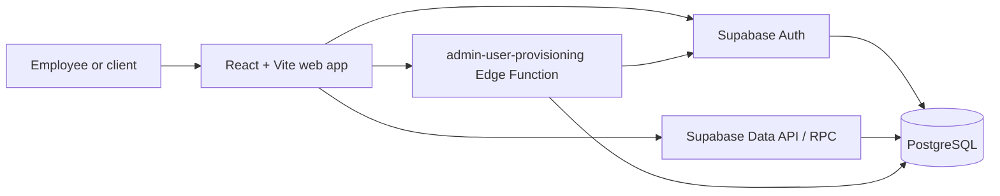

# COS — Central Operating System

COS is an internal operating portal for governed company operations. The current product combines identity and user provisioning, Sales & Marketing workspace navigation, a fully modelled Content & Social workflow, a Management command shell, approval flows, and legacy business-record demonstrations.

The repository is intentionally a single React application backed by Supabase. It is not a monorepo and it does not contain a traditional Node API server.

## Product status

| Area | Current implementation |
| --- | --- |
| Identity and access | Supabase Auth, centralized route guards, `get_my_authorization()`, five global roles |
| User provisioning | Governed request/CEO approval/technical invitation flow through one Edge Function |
| Sales & Marketing | Permission-filtered navigation, searchable records, deal creation shell, dashboards |
| Content & Social | Feature-owned domain model, repository, membership authorization, approvals, scheduling, publishing, metrics, audit |
| Management | Executive navigation, search, static dashboards and governance views |
| Legacy operations data | Companies, products, deals, quotes, orders, invoices, cylinders, tickets, campaigns, approvals, audit logs; currently empty in the connected database |

Several Sales, Marketing, and Management destinations are product-direction shells rather than complete transactional modules. See [module ownership](docs/modules/overview.md) for the implemented boundary.

## Architecture



Browser access to Supabase is intentional: the browser receives only a publishable/anon key and user session, while PostgreSQL Row Level Security is the data boundary. Privileged user administration is server-only in the Edge Function. No service-role credential may enter `VITE_*`, frontend source, logs, or fixtures.

Read the [architecture overview](docs/architecture/overview.md), [security model](docs/security/overview.md), and [2026-09-09 audit](docs/audit/2026-09-09-codebase-audit.md) before changing cross-cutting code.

## Repository structure

```text
src/
  app/                 routing and legacy portal-data boundary
  auth/                session, authorization, guards, provisioning client
  components/          shared UI and current workspace shells
  content-social/      cohesive Content & Social feature
  navigation/          workspace navigation definitions
  test/                Vitest setup
supabase/
  functions/           privileged Edge Functions
  migrations/          ordered, immutable PostgreSQL migration history
scripts/               guarded bootstrap, seed, and cleanup utilities
e2e/                   Playwright journeys
docs/                  canonical engineering documentation
assets/                static design assets
```

Top-level `supabase_schema.sql`, `supabase_rls.sql`, and `supabase_content_social.sql` are historical snapshots. New database work belongs only in deterministic files under `supabase/migrations/`.

## Authentication and authorization

Supabase Auth owns credentials, sessions, recovery, and invitation confirmation. After session restoration, the client calls `public.get_my_authorization()` and derives all route access from its returned profile, role, permissions, and workspaces.

Allowed global roles are `CEO`, `MANAGEMENT`, `SALES`, `MARKETING`, and `SOFTWARE_ENGINEER`. Content & Social membership is a separate scoped authorization system. Route checks improve UX; RLS and server-side checks remain authoritative.

User provisioning is available only through `supabase/functions/admin-user-provisioning`. Public signup is not implemented. See [identity and provisioning](docs/modules/identity-and-provisioning.md).

## Local development

Requirements: Node.js 20+ and npm.

```powershell
npm.cmd ci
Copy-Item .env.example .env.local
npm.cmd run dev
```

Set `VITE_SUPABASE_URL` and `VITE_SUPABASE_ANON_KEY` in `.env.local`. Use a publishable/anon key only. The app runs at `http://localhost:3000`.

Development fixtures are deliberately opt-in:

```dotenv
VITE_COS_ALLOW_DEMO=true
```

The flag works only in a Vite development build. Production never falls back to fixtures.

Full setup and database instructions are in [development setup](docs/development/setup.md).

## Commands

| Command | Purpose |
| --- | --- |
| `npm run dev` | Start Vite on port 3000 |
| `npm run lint` | Run TypeScript with no emit |
| `npm run test:run` | Run the Vitest suite once |
| `npm run test:e2e` | Run Playwright on desktop and mobile projects |
| `npm run build` | Produce the production bundle in `dist/` |
| `npm run clean` | Remove generated `dist/` and legacy `server.js` |
| `npm run seed` | Run the guarded, empty-database-only legacy fixture seed |

E2E workspace journeys require `COS_E2E_EMAIL` and `COS_E2E_PASSWORD` for an approved test account. The public client-approval routing check needs no account.

## Database changes

1. Inspect the live schema, migration list, grants, functions, and RLS policies.
2. Create a new timestamped migration in `supabase/migrations/`; never edit an applied migration.
3. Review role/permission or policy changes explicitly with the project administrator.
4. Apply and verify in staging first.
5. Run security/performance advisors and relevant authorization tests.

The seed script is destructive in effect even though it only inserts. It requires the expected project reference, the exact confirmation phrase, server-side credentials, and every target table to be empty. See [database architecture](docs/architecture/database.md).

## Deployment

The SPA has Vercel history-fallback configuration in `vercel.json`. Supabase migrations and Edge Functions deploy separately through the approved Supabase workflow. No CI/CD or Docker configuration is currently committed; deployments remain manual and must not be inferred from a frontend build.

## Documentation

- [Documentation index](docs/README.md)
- [Architecture](docs/architecture/overview.md)
- [Module ownership](docs/modules/overview.md)
- [API surfaces](docs/api/overview.md)
- [Security](docs/security/overview.md)
- [Setup](docs/development/setup.md)
- [Conventions](docs/development/conventions.md)
- [Troubleshooting](docs/development/troubleshooting.md)
- [Contribution guide](CONTRIBUTING.md)

## Contributing

Keep changes scoped, preserve the global/content authorization separation, add tests around non-obvious business rules, and run type checking, tests, and a production build before handoff. Do not commit, push, deploy, provision users, or change permissions without explicit authorization. See [CONTRIBUTING.md](CONTRIBUTING.md).
