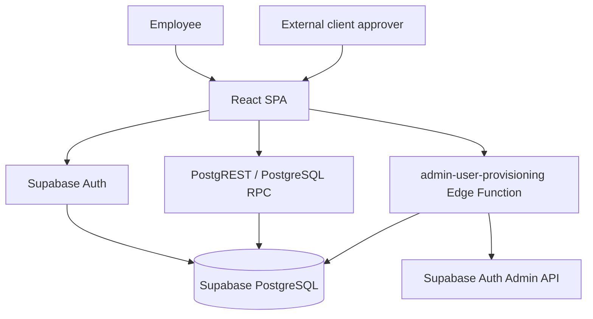
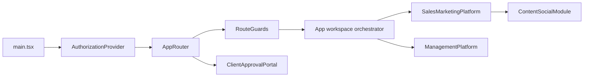
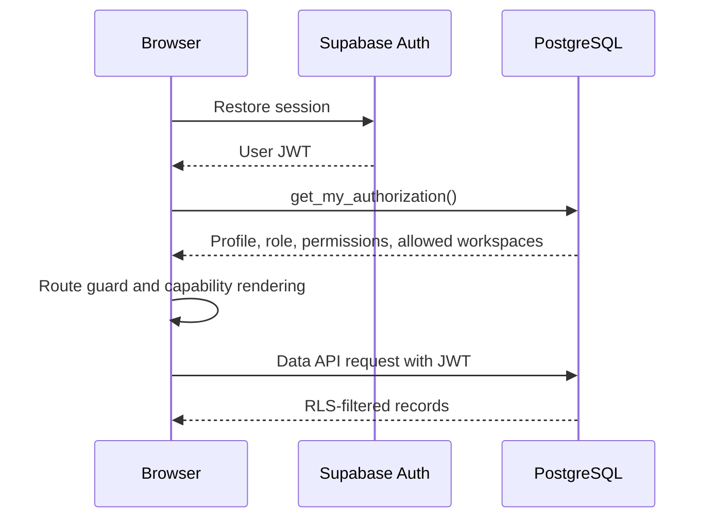
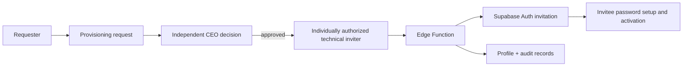
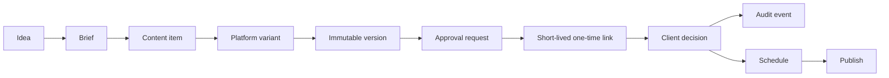

# System architecture

## What COS is

COS is a governed internal web portal. Employees authenticate once, receive a database-derived authorization snapshot, and enter the workspaces granted to them. The implemented system has two employee workspace shells—Sales & Marketing and Management—plus user provisioning, a design-system view, and a separately authorized Content & Social domain. External client approvers can use short-lived one-time links without receiving employee access.

## Runtime topology

There is no traditional REST server in this repository. Supabase provides authentication, the Data API, PostgreSQL functions, and one Deno Edge Function. This is deliberate for the current scale:

- normal browser operations use the publishable/anon key plus the user's JWT;
- PostgreSQL RLS must authorize every browser-visible table or function;
- privileged Auth Admin operations exist only in the Edge Function;
- feature-specific rules remain in feature code or database functions, not in the application shell.

## Frontend composition

`AppRouter` owns route selection. `App` only coordinates workspace transitions and shared legacy records. `usePortalData` is the single adapter for legacy tables and PostgreSQL/application naming conversion. Content & Social has its own repository because its scope, RLS, domain operations, and persistence contract are distinct.

## Data flows

Employee authorization:

User invitation:

Content approval:

## Architectural direction

Keep the single application until independent deployment or ownership creates a real need for a monorepo. New cohesive domains should follow the Content & Social pattern: a feature folder with its model, domain rules, repository, hook, UI, and tests. Shared folders are for genuinely cross-domain code only. Large workspace shells should be split incrementally by active route, not rewritten wholesale.

