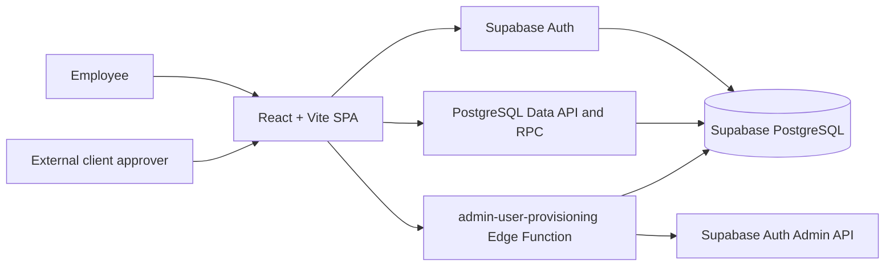
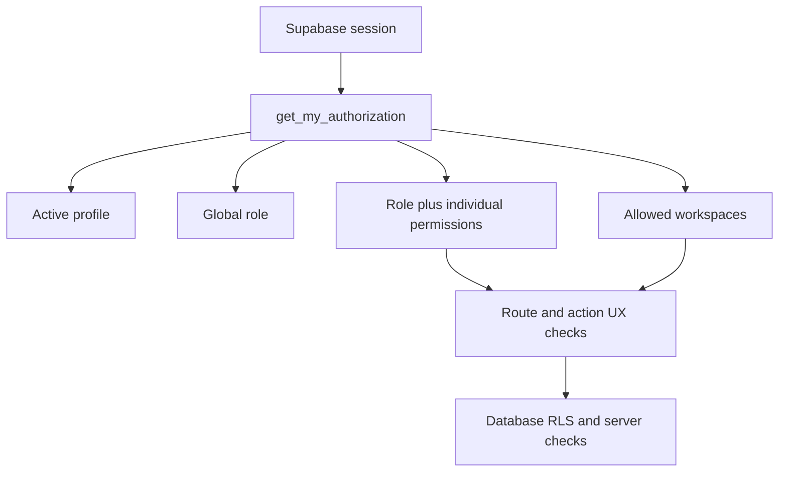

# COS — Software Development Progress & Implementation Report

**Prepared for:** CEO and project-management meeting  
**Report date:** 21 September 2026  
**Repository reviewed:** `main` at `bfa473f`  
**Remote-tracking state:** local branch is one commit behind `origin/main` (`57f2aae`)  
**Document purpose:** evidence-based progress, implementation, risk, decision, and next-phase report

> **Executive position:** COS has a credible identity, authorization, provisioning, and Content & Social foundation. It is not production-ready as a complete operating system. The immediate constraint is no longer basic screen construction; it is correcting authorization/RLS defects, validating real Sales and Marketing processes, completing live role-based testing, and obtaining management decisions before transactional workflows are encoded.

---

## 1. Executive Summary

COS is a governed internal web portal intended to bring company operations, controlled user access, Sales and Marketing work, Content & Social operations, and management visibility into one operating environment. It is a single React/Vite application backed by Supabase Authentication, PostgreSQL, Row Level Security (RLS), database functions, and one privileged Edge Function for user administration.

The strongest implemented foundations are:

1. Supabase-based employee authentication, session restoration, password recovery, invitation activation support, and protected application routes.
2. A database-derived role and permission model with five approved global roles.
3. Centralized browser authorization through `public.get_my_authorization()`.
4. A server-only user-provisioning boundary with CEO review, individually granted technical invitation authority, audit events, and self-action protections.
5. Permission-filtered Sales & Marketing and Management workspace shells.
6. A broad Content & Social domain covering ideas, briefs, versions, approvals, schedules, manual publishing proof, community/listening records, metrics, notifications, and audit evidence.
7. Development-only fixture controls that prevent silent production fallback to legacy demo records.
8. Environment validation, manual deployment support, automated unit/component tests, and public-route browser smoke tests.

The current development stage is **foundation implemented; business workflows and production controls under validation**. Content & Social is the most complete business domain in the repository, but its live scoped access is blocked by two known RLS policy defects. Sales & Marketing and Management contain extensive navigation and presentation content, but most destinations are not complete transactional modules. The legacy business tables are empty in the latest checked-in live audit and have RLS enabled without policies, so browser access is deny-by-default.

The six main technical blockers are:

1. The checked-in authorization RPC grants every `SOFTWARE_ENGINEER` both business workspaces, contrary to the intended interface-inspection-only rule.
2. Two Content & Social workspace/client membership policies are malformed and can deny legitimate scoped access.
3. Legacy business tables do not yet have approved ownership, RLS policies, and transaction rules.
4. Credentialed tests for all five roles and representative Content & Social memberships have not been completed in the current validation run.
5. Live migration/deployment alignment after the 9 September individual-access migration is not verified, and the local branch is one UI commit behind the remote-tracking branch.
6. The invitation confirmation interstitial exists, but the current invitation sender still redirects to `/auth/complete`; the scanner-resistant `/auth/confirm` path is not verified end to end.

Engineering also needs direct business input. Sales stages, discount/quote/order approvals, Marketing campaign and content approval processes, management visibility, CEO thresholds, reporting requirements, escalation rules, notification expectations, integration requirements, UAT ownership, and the definition of “production-ready” must be decided by the responsible stakeholders. These rules should not be invented by engineering.

## 2. Status and Evidence Rules

### 2.1 Status labels used in this report

| Label | Meaning |
|---|---|
| **COMPLETED** | Implemented and supported by repository evidence and current validation. This does not automatically mean production-approved. |
| **IMPLEMENTED - REQUIRES TESTING** | Code/schema exists, but representative live or end-to-end validation remains. |
| **PARTIALLY IMPLEMENTED** | A meaningful part exists, but the end-to-end business capability is incomplete. |
| **UI ONLY** | Navigation or presentation exists without a complete owned workflow, persistence, authorization, and test boundary. |
| **IN PROGRESS** | Recent work exists and the capability is actively evolving. |
| **PLANNED** | Supported by project direction but not implemented. |
| **BLOCKED** | Progress or production use is prevented by a verified defect, missing approval, or missing dependency. |
| **REQUIRES BUSINESS DECISION** | Engineering needs a business rule or accountable owner before implementation. |
| **UNKNOWN / NOT VERIFIED** | The repository does not contain enough current evidence to make the claim. |

### 2.2 Evidence basis

This report was produced from read-only inspection of:

- root and canonical documentation, including the 9 September codebase audit;
- application routing, authentication, authorization, workspace shells, navigation, and data adapters;
- all 17 local Supabase migration files and the `admin-user-provisioning` Edge Function;
- Content & Social model, domain rules, repository, orchestration hook, UI, and client approval portal;
- unit/component and Playwright tests;
- environment and deployment configuration;
- Git status, current branch, local/remote divergence, recent commits, and file-change history.

No application source, database object, migration, user, permission, deployment, commit, push, or live business record was changed. Validation outputs were directed to temporary locations, and the working tree remained clean.

### 2.3 Important limits

- The latest detailed live Supabase inspection captured in the repository is dated 9 September 2026. This report does not claim a fresh live database inspection on 21 September.
- The current user roster, current Auth settings, and current deployment versions are **not verified in the repository**.
- A local migration added on 9 September targets one named engineer for individual access, but the checked-in live audit only confirms migration alignment through 3 September.
- The local branch is one commit behind the existing `origin/main` reference. This report describes the checked-out local code and separately records the remote-only UI commit.

## 3. What COS Is Intended to Achieve

### Verified objectives

- **Centralized governed operations — IN PROGRESS.** COS is intended to be one authenticated entry point for business workspaces and controlled operations.
- **Secure role-based access — IMPLEMENTED - REQUIRES TESTING.** Global access comes from roles, role permissions, individual permissions, and a server-generated authorization snapshot.
- **Sales management — PARTIALLY IMPLEMENTED.** Navigation, search, dashboard summaries, record inspection, and a limited deal-creation path exist; most sales routes remain shells.
- **Marketing management — PARTIALLY IMPLEMENTED.** Navigation, shared campaign records, summaries, and Content & Social hosting exist; most marketing routes remain shells.
- **Content & Social operations — IMPLEMENTED - REQUIRES TESTING.** A comprehensive domain and database design exists, but live scoped access has known policy defects and external integrations remain manual.
- **Management visibility and CEO oversight — UI ONLY / PARTIAL.** The Management workspace has broad executive navigation and search over supplied legacy collections; most figures and governance views are static examples.
- **Employee user management — IMPLEMENTED - REQUIRES TESTING.** Requests, CEO decisions, technical invitations, activation, profile/role/status actions, and audits exist in the server boundary; the current UI exposes only part of that contract.
- **Approval workflows — PARTIAL.** Employee provisioning approval and Content & Social exact-version approval are implemented. General business transaction approval rules are not defined or implemented end to end.
- **Reporting and notifications — PARTIAL.** Content & Social has a sourced metric ledger and notification inbox model. General executive reporting and automated notification delivery are not implemented.
- **Auditing — PARTIAL TO IMPLEMENTED.** Provisioning and Content & Social have dedicated audit structures. The legacy audit table remains part of a demonstration boundary.
- **Future workflow automation — PLANNED.** No queue, cron system, background worker, webhook layer, or no-code automation engine is present.

## 4. Current System Architecture

The application has no Express server, Next.js API routes, queue, cron worker, email service, or general REST API. The browser uses a publishable Supabase key and the signed-in user’s JWT. PostgreSQL RLS is the final data boundary. The only service-role boundary is the user-provisioning Edge Function and guarded server-side scripts.

Content & Social does not use the global role as its data authorization. It resolves a separate membership scoped to workspace, client, and brand, then relies on Content & Social RLS policies.

## 5. Development Phase Assessment

| Phase | Objective | Verified implementation | Testing/evidence | Current status | Remaining work |
|---|---|---|---|---|---|
| **1 - Authentication** | Secure employee sign-in and account recovery | Supabase password sign-in, session restoration/refresh, recovery request, password setup, sign-out, invitation activation call, no public signup | Auth helper tests; safe configured-auth browser check | **IMPLEMENTED - REQUIRES TESTING** | Verify invitation and recovery links end to end in staging; confirm scanner-resistant route wiring; recheck Auth settings |
| **2 - RBAC** | Approved roles and permissions | Five roles, role permissions, individual profile permissions, active-profile gate | Authorization and provisioning policy tests | **IMPLEMENTED - REQUIRES TESTING** | Correct workspace overgrant; run five-role positive/negative tests |
| **3 - RLS** | Database-enforced row access | Extensive Content & Social RLS; legacy tables deny by default because no policies | Migration review; 9 September live audit | **PARTIAL / BLOCKED** | Correct two CS policies; design legacy policies; add live RLS integration tests |
| **4 - Server authorization RPC** | One trusted browser authorization snapshot | `get_my_authorization()` returns profile, role, effective permissions, and workspaces | Parser/fail-closed unit tests | **IMPLEMENTED WITH BLOCKER** | Remove unintended `SOFTWARE_ENGINEER` business workspace mapping through approved migration |
| **5 - Application authorization** | Centralized route and capability checks | `AuthorizationProvider`, `ProtectedRoute`, permission/workspace checks, permission-filtered navigation | Unit/component tests; public browser smoke | **COMPLETED AS UX LAYER** | Improve action-level visibility; keep RLS/server checks authoritative |
| **6 - Controlled user provisioning** | Governed account lifecycle | Request, CEO decision, technical invitation, activation, profile/role/status operations, audit, origin validation, self-action controls | Policy/client tests; code and migration review | **IMPLEMENTED - REQUIRES TESTING** | Full staging journey, reconciliation/idempotency, complete UI exposure, CEO-role-specific policy decision |
| **7 - Workspace/module visibility and staging testing** | Expose workspaces safely for review | Workspace matrix, staging interface permission, fixed-scope staging CS memberships | Navigation tests; credentialed E2E defined | **PARTIAL / TESTING** | Resolve visibility/membership mismatch and run controlled UAT with representative users |

## 6. Authentication and User Access

### 6.1 Implemented architecture

- Supabase Auth owns credentials, password validation, session tokens, refresh tokens, recovery, invitations, and logout.
- COS implements no public signup route.
- The login form calls `signInWithPassword` and shows a generic invalid-credentials message.
- The Supabase client is configured with session persistence, automatic refresh, and URL-session detection.
- “Remember me” stores only a normalized work email in local storage. It does not store a password, token, role, permission, or workspace grant.
- After a session exists, the application calls `get_my_authorization()`. A user without one active matching profile receives a fail-closed “authorization profile unavailable” state.
- Protected routes support workspace checks and named permission checks.
- Password recovery gives the same response whether or not an account exists, reducing account-enumeration risk.
- Password setup requires 12 characters and then calls the provisioning Edge Function to change an invited profile to active.

### 6.2 Profile and invitation states

Profiles support `invited`, `active`, `suspended`, and `disabled`. Provisioning requests support `PENDING`, `CEO_APPROVED`, `READY_FOR_INVITATION`, `INVITATION_SENT`, `ACCOUNT_ACTIVATED`, rejection, cancellation, and disabled states. Only an active profile is returned by the authorization snapshot.

### 6.3 Current invitation/activation assessment

Repository history confirms that a confirmation page was added on 1 September to prevent email scanners from consuming an invite or recovery token before the person explicitly continues. The page validates `token_hash` and the `invite`/`recovery` type, then calls Supabase `verifyOtp` only after the button is pressed.

However, the current Edge Function’s invitation URL still resolves to `/auth/complete`, while the scanner-resistant page is `/auth/confirm`. Therefore:

- the mitigation page is **implemented**;
- the current invitation sender’s use of that page is **not verified**;
- the recent issue cannot be described as fully resolved from repository evidence alone;
- a real staging invitation should be tested from email receipt through password setup, activation, authorization snapshot, and first workspace entry.

### 6.4 Staging authentication flow

```mermaid
flowchart LR
  Request[Employee request] --> CEO[CEO approve/reject]
  CEO -->|approved| Ready[Ready for invitation]
  Ready --> Tech[Authorized technical inviter]
  Tech --> Invite[Supabase invitation]
  Invite --> Setup[Password/session setup]
  Setup --> Activate[activate_invitation]
  Activate --> Profile[Active profile]
  Profile --> Snapshot[get_my_authorization]
  Snapshot --> Workspace[Allowed workspace]
```

## 7. Global Role-Based Access Control

### 7.1 Approved roles

The only valid global roles are:

- `CEO`
- `MANAGEMENT`
- `SALES`
- `MARKETING`
- `SOFTWARE_ENGINEER`

No `ADMIN`, `SOFTWARE_LEAD`, or `FRONTEND_ENGINEER` role exists in the approved schema.

### 7.2 Effective permissions

Effective permissions are the union of:

1. permissions assigned to the user’s global role; and
2. permissions assigned directly to the user’s profile.

Only permissions with `active` status are returned. The browser consumes the returned list and never queries the RBAC tables directly.

This design allows technical provisioning authority to be granted to one approved engineer without giving it to every `SOFTWARE_ENGINEER`.

### 7.3 Why email-based authorization is not used

Email is mutable identity metadata and is unsuitable as an authorization rule. COS authorizes by the authenticated user ID, active profile, role, and permission records. The Edge Function uses email only for invitation delivery and self-target comparisons; it does not use a hard-coded email list to grant runtime access.

### 7.4 Permission overview

- `CEO` receives executive/business visibility and CEO provisioning review permissions, but does not inherit technical invitation, update, disable, or enable authority.
- `MANAGEMENT` receives management, reporting, customer, and read-oriented sales/marketing visibility.
- `SALES` receives sales view/create/update permissions.
- `MARKETING` receives marketing view/create/update permissions.
- `SOFTWARE_ENGINEER` receives workspace/system visibility by role; technical provisioning or broader business authority must be assigned individually.
- `testing.sales_marketing_interface.view` is staging/build-only navigation visibility for CEO, Management, and Software Engineer. It grants no business write, database, provisioning, or Content & Social data authority.

## 8. User Provisioning and Separation of Duties

### 8.1 Current workflow

The current code no longer implements two formal approvals. It implements two-person controlled execution:

1. A caller with `users.request` creates a request for another person.
2. An independent CEO with `users.approve` approves or rejects it.
3. Approval moves the request to `READY_FOR_INVITATION` and records technical approval as `not_required`.
4. An individually authorized `SOFTWARE_ENGINEER` with `users.invite` sends the invitation.
5. The Edge Function creates an invited profile with the approved global role.
6. The invitee sets a password and activates the profile.
7. Audit events record each privileged step.

“Dual approval” remains in older migration naming and compatible status fields, but the 3 September migration and current Edge Function establish CEO approval as the sole business approval. The technical operator performs a separated technical action; the operator is not a second business approver.

### 8.2 Controls verified in code

- The requester cannot create a request for their own email.
- A CEO cannot approve a request they created.
- An actor cannot approve, invite, or administratively alter their own account.
- A technical inviter must be both a `SOFTWARE_ENGINEER` and hold `users.invite` individually/effectively.
- CEO approval requires both the CEO role and `users.approve`.
- Profile, role, disable, and enable actions reject self-targets.
- The Edge Function validates the request origin against configured allowlisted origins.
- The service-role key is read only inside the Edge Function.
- Public error messages use stable codes and correlation IDs; internal details stay server-side.
- Audit events include request IDs and actor/target context.

### 8.3 UI versus server capability

The Edge Function supports request/user listing, request creation/cancellation, CEO approve/reject, invitation send/resend, invitation activation, profile editing, role changes, and account enable/disable. The current user-provisioning page exposes listing, request creation, CEO review, initial invitation, and cancellation. Resend, edit, role change, enable, and disable are server capabilities not yet exposed as complete UI workflows.

### 8.4 Named individual-authority claims

- **Jeremiah’s individual provisioning authority: NOT VERIFIED IN THE CURRENT REPOSITORY.** “Jeremiah” appears only in a remembered-email unit test and Git metadata, not in an authorization migration or runtime rule.
- **Ahmed’s lack of authority by role alone: VERIFIED AS A POLICY PRINCIPLE.** A unit test states that an engineer without `users.invite` does not receive provisioning authority merely from the `SOFTWARE_ENGINEER` role.
- **Akanni Ahmad’s individual expanded authority: IMPLEMENTED IN A LOCAL MIGRATION, LIVE APPLICATION NOT VERIFIED.** The 9 September migration conditionally finds exactly one active `SOFTWARE_ENGINEER` named Akanni Ahmad and grants 18 individual permissions, including user-provisioning and system-management capabilities. It also requires an existing separate `CS_MANAGER` membership. The latest checked-in live audit predates verification of this migration.

The name mismatch should be resolved before management relies on a person-specific authority statement.

### 8.5 Employee provisioning versus business transaction approval

| Workflow | Purpose | Current authority | Current maturity |
|---|---|---|---|
| **Employee/user provisioning** | Create and administer an employee identity and access profile | CEO decision plus an individually authorized technical inviter | **IMPLEMENTED - REQUIRES TESTING** |
| **Content approval** | Approve exact immutable Content & Social versions | Scoped Content & Social roles or a one-time client token | **IMPLEMENTED - REQUIRES TESTING** |
| **General business transaction approval** | Approve quotes, discounts, orders, payments, budgets, exceptions, etc. | Not yet defined by validated business rules | **REQUIRES BUSINESS DECISION / PLANNED** |

These workflows must not share status names, authorities, or assumptions merely because each includes the word “approval.”

## 9. Workspace Architecture and Visibility

### 9.1 Verified global workspace matrix

The following matrix reflects the current checked-in `get_my_authorization()` mapping, not the intended corrected design.

| Global role | Sales & Marketing | Management | Content & Social |
|---|---:|---:|---|
| CEO | Yes | Yes | Separate membership required; staging migration auto-assigns fixed-scope `CS_MANAGER` |
| MANAGEMENT | Yes | Yes | Separate membership required; staging migration auto-assigns fixed-scope `CS_MANAGER` |
| SALES | Yes | No | Separate membership required; no role-based staging auto-assignment |
| MARKETING | Yes | No | Separate membership required; no role-based staging auto-assignment |
| SOFTWARE_ENGINEER | **Yes - known overgrant** | **Yes - known overgrant** | Separate membership required; staging migration auto-assigns fixed-scope `CS_MANAGER` |

The `SOFTWARE_ENGINEER` mapping conflicts with the repository’s governance rule. The interface-testing permission should expose navigation for inspection without granting general business workspaces. Correcting this requires approval, a deterministic migration, and staged positive/negative tests.

### 9.2 Content & Social navigation mismatch

The Sales & Marketing UI currently shows the Content & Social navigation area only when the user has `testing.sales_marketing_interface.view`. That permission is granted by role to CEO, Management, and Software Engineer, but not Sales or Marketing. Content & Social data still requires a separate membership.

This creates two independent gates:

1. navigation visibility through a staging-only global permission; and
2. data authorization through scoped Content & Social membership and RLS.

That separation is secure in principle, but the current role assignments may prevent intended Sales/Marketing Content & Social users from reaching the module through normal navigation. Stakeholders must confirm the intended production discovery model.

## 10. Sales & Marketing Platform

### 10.1 Current structure

The navigation defines 13 areas:

1. Home
2. Strategy & Planning
3. CRM & Accounts
4. Sales Execution
5. Campaigns
6. Content & Social
7. Paid Media
8. Lifecycle & Customer Growth
9. Commerce & Conversion
10. Creators & Partnerships
11. Analytics & Intelligence
12. Commercial Operations
13. Settings & Governance

Settings & Governance is currently hidden from the visible-area filter. Sales-specific visibility covers CRM, Sales Execution, and Commerce. Marketing-specific visibility covers Campaigns, Paid Media, Lifecycle, and Partnerships. Shared areas appear when the user can view either Sales or Marketing. Staging interface permission exposes both sets for inspection without creating business authority.

### 10.2 Implemented behavior

- permission-filtered area visibility;
- global and area navigation, searchable submenus, responsive sidebar behavior;
- search across supplied companies, deals, campaigns, tasks, leads, and audit entries;
- dashboard summaries from supplied collections and local component state;
- record inspection;
- deal creation when `sales.create` is present, using the legacy data adapter;
- task and lead creation in local component state only;
- Content & Social hosting;
- explicit loading, empty, restricted, unavailable, and error states from the legacy data adapter.

### 10.3 Maturity by area

| Area | Current classification | Evidence-based note |
|---|---|---|
| Home/dashboard | **PARTIAL** | Summaries and shared records exist; tasks/leads include hard-coded local examples |
| CRM & Accounts | **PARTIAL / UI SHELL** | Company and lead presentation exists; no owned CRM service or complete durable lead workflow |
| Sales Execution | **PARTIAL** | Deal display and creation path exist; quotes, proposals, tenders, contracts, forecasts, commissions, and handoffs are navigation/product direction |
| Commerce & Conversion | **UI ONLY / PLANNED** | Labels exist; no owned commerce backend |
| Campaigns | **PARTIAL / UI SHELL** | Shared campaign records and summaries exist; no complete campaign workflow |
| Paid Media | **UI ONLY / PLANNED** | Navigation only; no media buying or connector layer |
| Lifecycle & Customer Growth | **UI ONLY / PLANNED** | Navigation only; no email/SMS/WhatsApp automation or consent service |
| Creators & Partnerships | **UI ONLY / PLANNED** | Navigation only; no contract, payout, or partner workflow |
| Analytics & Intelligence | **PARTIAL / UI SHELL** | Shared metrics are displayed; no general reporting engine or attribution service |
| Commercial Operations | **PARTIAL / UI SHELL** | Shared records and local tasks; no complete project/SLA/cost service |
| Settings & Governance | **HIDDEN / PLANNED** | Route definitions exist but area is filtered out |
| Content & Social | **IMPLEMENTED - REQUIRES TESTING** | Separate feature boundary and database domain; see Section 11 |

### 10.4 Module visibility is not action authorization

Seeing a menu item means only that the interface is visible. It does not mean the user can read every underlying row or execute every action. Business action authorization must be separately checked in the UI, server function/domain layer, and RLS. `testing.sales_marketing_interface.view` is the clearest example: it exposes navigation only.

### 10.5 Current limitations

- Most submenu routes change labels and filtered record views rather than load independent, owned modules.
- Local task and lead state is not durable.
- The legacy tables are empty in the latest live audit and currently lack browser RLS policies.
- Hard-coded task/lead examples and static metrics can appear as operational content; management should treat them as design/demo content, not verified company data.
- Real Sales and Marketing terminology, stages, responsibilities, approvals, and reports have not been validated with accountable users.

## 11. Content & Social Platform

### 11.1 Authorization model

Content & Social is not another global COS role. It has its own scoped membership table:

- **Workspace**: top-level Content & Social tenant boundary.
- **Client**: organization/client within a workspace.
- **Brand**: operating brand within a client.
- **Membership**: user plus workspace/client/brand scope and a Content & Social role.

Module roles include `CS_MANAGER`, `PLANNER`, `CONTRIBUTOR`, `SOCIAL_COMMUNITY`, `PERFORMANCE_ANALYST`, `ACCOUNT_BRAND`, `EXECUTIVE_VIEWER`, `MODULE_ADMIN`, and `CLIENT_APPROVER`.

Every primary business row carries workspace, client, and brand IDs. Browser queries are filtered to the active scope, and RLS checks membership scope and role.

### 11.2 Workflow architecture

```mermaid
flowchart LR
  Idea --> Brief
  Brief --> Item[Content item]
  Item --> Variant[Platform variant]
  Variant --> Version[Immutable version]
  Version --> Approval[Exact-version approval]
  Approval --> Schedule
  Schedule --> Manual[External manual publication]
  Manual --> Proof[Publication evidence]
  Proof --> Metrics
  Metrics --> Review[Performance review]
```

### 11.3 Capability assessment

| Capability | Status | What is actually implemented |
|---|---|---|
| Workspace/client/brand scope | **IMPLEMENTED WITH BLOCKER** | Tables, membership model, query filters, and RLS exist; two scope-selection policies are malformed |
| Ideas | **IMPLEMENTED** | Validated creation, source, owner, priority, conversion to brief, audit event |
| Briefs | **IMPLEMENTED** | Draft, submit, approve/change-request state, required-field validation, conversion to production work |
| Content items | **IMPLEMENTED** | Scoped records, lifecycle state, owner, due date, priority, exceptions, tags |
| Assignments | **PARTIAL** | Owner fields exist; there is no dedicated assignment entity, workload engine, or reassignment workflow |
| Platform variants | **IMPLEMENTED** | Channel/format variant with current-version linkage |
| Immutable versions | **IMPLEMENTED** | Version lineage, revision constraint, database trigger preventing update/delete, stale approval invalidation |
| Internal/scoped approval | **IMPLEMENTED - REQUIRES TESTING** | Exact-version requests and decisions with role checks and stale detection |
| Public client approval | **IMPLEMENTED - REQUIRES TESTING** | High-entropy hashed one-time token, expiry, revocation, exact-version data, client decision, audit event |
| Scheduling | **IMPLEMENTED - REQUIRES TESTING** | Approved current version, planned time/timezone, manual-ready queue |
| Publication | **MANUAL IMPLEMENTATION ONLY** | Live URL, actual time, evidence note, and database proof guard; no direct social publishing |
| Asset library | **PARTIAL** | External URLs, provider, type, rights status, usage IDs; no native upload, transcoding, CDN, or renditions |
| Community inbox | **MANUAL IMPLEMENTATION ONLY** | External thread register, classification, ownership, status, response draft field; no social inbox connector |
| Social listening | **MANUAL IMPLEMENTATION ONLY** | Source URL, topic, severity, sentiment, owner, conversion to idea; no connected feed |
| Metrics/performance | **PARTIAL** | Manual/imported/estimated/verified observations with source reference; no automated analytics connectors |
| Notifications | **PARTIAL** | Table, scoped recipient read/update policy, drawer, read state; no verified event-generation or delivery service |
| Audit | **IMPLEMENTED** | Scoped append-only browser contract and action events; client-token decisions also append events |
| Archive/recycle/restore | **PARTIAL** | Soft-delete metadata exists; no complete recycle-bin/restore UI |
| Settings | **UI/INFORMATIONAL** | Security context, adapter policy, audit view, demo reset; no full membership/workflow administration UI |

### 11.4 What requires staging membership

Live Content & Social data requires an authenticated user with a matching `cs_memberships` row for the active workspace, client, and brand. The staging migration auto-creates fixed DELabs `CS_MANAGER` memberships for active CEO, Management, and Software Engineer profiles and tracks those grants separately. This is explicitly staging-only and should not be treated as a production role mapping.

### 11.5 What is not connected externally

There are no direct publishing connectors, social-message ingestion adapters, automated listening feeds, native asset storage/transcoding, external analytics ingestion services, email/push notification services, or third-party workflow webhooks. Launch behavior is intentionally manual or link-based.

### 11.6 Content & Social risks requiring technical work

- Correct the malformed `cs_workspaces_member_select` and `cs_clients_member_select` policies through an approved migration.
- Run positive and negative tests for workspace-wide, client-scoped, brand-scoped, and no-membership users.
- Align Content & Social navigation with intended production users rather than the staging interface permission.
- Hide or disable action controls based on module permissions consistently; several operations currently fail after the user clicks rather than being hidden in advance.
- Add explicit permission checks to all client-side action helpers for consistent UX, while retaining RLS as the final boundary.
- Add real database integration tests for RLS, immutable versions, transition triggers, approval token expiry/revocation, and publication proof.

## 12. Database and Backend

### 12.1 Technology and source of truth

- Supabase PostgreSQL 17 is the documented database platform.
- `supabase/migrations/` is the authoritative local schema history.
- There are 17 migration files in the current repository.
- Root files `supabase_schema.sql`, `supabase_rls.sql`, and `supabase_content_social.sql` are historical snapshots and must not be used for new changes.

### 12.2 Main domains

| Domain | Main objects |
|---|---|
| Global identity/RBAC | `profiles`, `roles`, `permissions`, `role_permissions`, `profile_permissions`, authorization RPC |
| User provisioning | `user_provisioning_requests`, `user_provisioning_audit_logs`, bootstrap RPCs, Edge Function |
| Content & Social scope | `cs_workspaces`, `cs_clients`, `cs_brands`, `cs_memberships`, staging grant tracker |
| Content workflow | ideas, briefs, content items, platform variants, immutable versions, approvals, schedules, publish records |
| Content operations | assets, community records, listening signals, metrics, notifications, audit events |
| Legacy operations | companies, products, deals, quotes, orders, invoices, cylinder balances, tickets, campaigns, approvals, audit logs |

### 12.3 RPCs and privileged functions

- `get_my_authorization()` returns the active caller’s effective global authorization.
- `cs_issue_approval_token(...)` issues a short-lived client token to authorized scoped members.
- `cs_client_approval(...)` validates a token, returns exact versions, records a decision, revokes the token, and appends audit evidence.
- Bootstrap functions exist for initial staging provisioning setup and are service-role only.
- `admin-user-provisioning` is the only privileged application Edge Function.

### 12.4 Constraints, triggers, and indexes

Verified controls include:

- allowed role and status check constraints;
- unique role/permission keys and profile-permission pairs;
- unique open provisioning request per email;
- provisioning state-consistency checks;
- updated-at triggers;
- Content & Social scope foreign keys and business-number uniqueness;
- immutable content-version trigger;
- lifecycle-transition trigger;
- stale-approval invalidation trigger;
- publication-proof trigger;
- hashed approval-token uniqueness;
- scope, lifecycle, date, status, notification, audit, and foreign-key indexes.

The latest checked-in audit also records outstanding database work: a missing primary key on `cylinder_balances`, eight then-advised unindexed foreign keys, and legacy domain ownership/RLS design.

## 13. Security Implementation

### 13.1 Implemented controls

- Supabase Auth for passwords and JWT-based sessions.
- Automatic token refresh and session persistence managed by the Supabase client.
- Active-profile requirement before authorization is returned.
- Five-code global role constraint.
- Role plus individual permission calculation inside a security-definer RPC.
- Centralized route guards and permission/workspace checks.
- Content & Social scope membership separated from global RBAC.
- RLS on authorization, provisioning, Content & Social, and legacy tables.
- Service-role isolation in the Edge Function and guarded scripts.
- Origin allowlisting for user-provisioning requests.
- Production build validation rejecting placeholders, secret keys, and service-role JWTs in browser configuration.
- Self-request, self-approval, self-invitation, self-role-change, and self-disable/enable protections.
- Provisioning and Content & Social audit records.
- One-time, hashed, expiring, revocable client approval tokens.
- Development-only demo gating for legacy and Content & Social repositories.
- `.env.local` is ignored and not tracked.

### 13.2 Outstanding security work

- Correct the global workspace overgrant.
- Correct the two malformed Content & Social scope policies.
- Design explicit RLS policies for each legacy business domain rather than broad authenticated access.
- Run live RLS tests with representative roles/memberships and negative cases.
- Confirm Auth OTP expiry is one hour or less and enable leaked-password protection; the 9 September audit found these settings outstanding.
- Add an explicit Content Security Policy and a referrer policy to reduce approval-token URL leakage.
- Add reconciliation/idempotency for cross-system provisioning operations.
- Review broad execute grants on security-definer RPCs whenever their internal checks change.
- Add monitoring around correlation IDs, provisioning failures, approval-token failures, and unexpected authorization denials.

## 14. Staging Environment

### 14.1 Purpose

Staging exists to validate authentication, authorization, workspace visibility, Content & Social membership, RLS, and real user workflows before production rollout. Several capabilities are explicitly staging/build-only.

### 14.2 Verified staging-only behavior

- `testing.sales_marketing_interface.view` exposes Sales & Marketing navigation for inspection only.
- The staging Content & Social migration auto-assigns fixed DELabs `CS_MANAGER` memberships to active CEO, Management, and Software Engineer profiles.
- One-time bootstrap scripts create the initial technical provisioning administrator and initial CEO under exact project-reference and confirmation guards.
- Development fixtures require a development build and `VITE_COS_ALLOW_DEMO=true`.

### 14.3 Users and data

The current Auth user list is **not verified in the repository**. The 9 September audit reported:

- five global roles and 24 permissions at that time;
- one Content & Social workspace, one client, one brand, and three memberships;
- no Content & Social business workflow rows;
- empty legacy business tables.

A later 9 September migration targets a single active engineer named Akanni Ahmad, but live application of that migration is not verified here. No repository evidence verifies a current runtime grant for Jeremiah.

### 14.4 Production protections

- Production builds reject missing, placeholder, secret, or service-role browser credentials.
- Demo fallback is disabled in production.
- Supabase migrations and Edge Functions deploy separately from the frontend.
- The seed and bootstrap scripts require exact project references and confirmation values.
- No public signup exists.

## 15. Testing Performed

### 15.1 Current validation run - 21 September 2026

| Area | Test | Result | Notes |
|---|---|---|---|
| TypeScript | `npm run lint` (`tsc --noEmit`) | **PASS** | No TypeScript errors |
| Unit/component | `npm run test:run -- --reporter=verbose` | **PASS** | 16 files, 58 tests passed |
| Production build | `npm run build` to a temporary output directory | **PASS** | 2,238 modules transformed; main entry 485.38 kB before gzip |
| Public browser smoke | Playwright desktop and mobile | **PASS** | 4 passed: configured Auth endpoint and public client-approval routing |
| Credentialed employee E2E | Playwright | **SKIPPED** | 10 skipped because credentials were intentionally disabled; these journeys can create staging data |
| Git cleanliness after validation | `git status` | **PASS** | Working tree remained clean; branch still behind remote by one commit |

### 15.2 Unit/component coverage areas

- authorization snapshot parsing and fail-closed behavior;
- workspace normalization and named permission checks;
- provisioning role list, error sanitization, CEO/technical separation, and no role-only technical authority;
- remembered-email convenience behavior;
- invitation/recovery token parsing;
- Supabase production environment validation;
- portal database name conversion and error classification;
- Sales & Marketing visibility and non-escalation of interface permission;
- shared sidebar and typography behavior;
- Content & Social permission matrix, lifecycle transitions, exact-version approvals, stale approvals, scheduling, publication proof, search, validation, demo gating, and selected component states.

### 15.3 Test gaps

- No current live database RLS integration suite is committed.
- No five-global-role credential matrix was executed in this run.
- No representative Content & Social membership-scope matrix was executed in this run.
- No end-to-end invitation email, password setup, activation, and first authorization test was executed.
- No automated test proves provisioning compensation/reconciliation after a partial Auth/database failure.
- No test coverage report was generated, so percentage coverage is unknown.
- The repository has no committed CI workflow to run these gates automatically.

## 16. Significant Issues Discovered and Resolved

### 16.1 Public client approval opened login

**Problem ->** Anonymous client approval links were handled after employee route protection.  
**Cause ->** Approval routing lived inside the authenticated application path.  
**Resolution ->** Approval-token routing moved to `AppRouter` before employee guards, with canonical and legacy token support.  
**Current status -> COMPLETED.** Public desktop/mobile smoke tests pass with an invalid token and remain outside the employee shell.

### 16.2 Silent demo fallback and stale business records

**Problem ->** Development data could appear when Supabase was unavailable, risking confusion about what was real.  
**Cause ->** Demo fallback was not consistently gated.  
**Resolution ->** Both legacy and Content & Social fixtures now require a development build plus `VITE_COS_ALLOW_DEMO=true`; production shows explicit empty/unavailable/unauthorized states.  
**Current status -> COMPLETED for repository adapters.** Static presentation data still exists in workspace components and must be clearly treated as UI content.

### 16.3 Legacy Data API mapping and write errors

**Problem ->** Legacy PostgreSQL rows and TypeScript models used different naming conventions, and some writes did not reliably surface Supabase errors.  
**Cause ->** Data access was spread through `App.tsx`.  
**Resolution ->** Routing and the legacy adapter were extracted; recursive snake_case/camelCase conversion, explicit error checks, and optimistic rollback were added.  
**Current status -> COMPLETED, with legacy RLS still blocking production use.**

### 16.4 Migration-history mismatch

**Problem ->** Eight applied Content & Social migrations were absent locally, and the CEO migration timestamp differed.  
**Cause ->** Local migration history had drifted from the connected project.  
**Resolution ->** The missing files were recovered from live migration history, and the CEO filename was aligned to `20260903083257`.  
**Current status -> COMPLETED through 3 September in the 9 September audit.** The later 9 September individual-access migration is not confirmed live by current repository evidence.

### 16.5 Invitation configuration/origin failures

**Problem ->** Invitation delivery could fail because the application origin or allowed origins were not configured consistently.  
**Cause ->** Redirect/origin assumptions were not sufficiently validated.  
**Resolution ->** The Edge Function now validates `COS_APP_ORIGIN` and `COS_ALLOWED_ORIGINS`, returns safe configuration/delivery error codes, and the browser maps them to non-sensitive messages.  
**Current status -> IMPLEMENTED - REQUIRES STAGING VERIFICATION.**

### 16.6 Email scanner consumption of one-time links

**Problem ->** Automated email scanners can consume a one-time Auth link before the employee uses it.  
**Cause ->** Immediate token exchange on link navigation.  
**Resolution ->** An explicit confirmation page and token parser were added so the token can be exchanged after a person clicks Continue.  
**Current status -> PARTIAL / NOT VERIFIED END TO END.** The current invitation sender still redirects to `/auth/complete`, not `/auth/confirm`.

### 16.7 Duplicate/unreachable UI and large application shell

**Problem ->** Routing, hidden sidebar markup, and unreachable gateway variants made behavior harder to reason about.  
**Cause ->** Earlier design iterations accumulated in the main shell.  
**Resolution ->** Routing and legacy persistence were extracted; unreachable variants and a duplicate hidden Management sidebar were removed; workspace bundles were lazy-loaded.  
**Current status -> COMPLETED for the identified paths.** Large presentation components remain maintainability debt.

## 17. Current Blockers

### 17.1 Technical blockers

| # | What is blocked | Why | Owner/input needed | Consequence | Proposed next step |
|---:|---|---|---|---|---|
| 1 | Correct global workspace access | `SOFTWARE_ENGINEER` currently receives both business workspaces | Project administrator + engineering | Unintended workspace exposure | Approve and implement a migration; test all five roles |
| 2 | Reliable Content & Social scoped access | Two membership scope policies contain ambiguous identifiers | Project administrator + engineering | Valid members may be denied; scope assurance is incomplete | Approved corrective migration plus positive/negative RLS tests |
| 3 | Live legacy Sales/Marketing/Management data | Eleven tables have RLS but no policies and unclear ownership | Sales, Marketing, Management, security | Shells cannot become production transaction systems | Define owners/actions, then implement one domain at a time |
| 4 | Production authorization sign-off | Credentialed role and membership tests were skipped | Approved staging users + engineering | UI and RLS combinations remain unproven | Controlled five-role and scoped-membership test matrix |
| 5 | Deployment/migration alignment | Local branch is behind remote; live migration state after 9 September is unverified | Release owner + database administrator | Environment may not match this report | Compare frontend commit, migration list, and Edge Function version in staging |
| 6 | Invitation activation sign-off | Confirmation interstitial and invitation redirect are not proven as one flow | Technical provisioning owner | Invite links may still be vulnerable to scanner/session failures | Wire intended route, then run fresh invite-to-first-login test |

### 17.2 Business decisions required

Engineering is additionally blocked from completing business workflows until accountable stakeholders define Sales stages, Marketing processes, approval thresholds, visibility, reports, notifications, escalation, and launch acceptance criteria. These are decisions, not coding assumptions.

## 18. Business Decisions & Stakeholder Input Required

COS cannot be completed correctly by engineering alone. The following 12 decision groups require CEO or delegated management direction.

### 18.1 Sales team input

1. **Sales process owner and canonical workflow.** Who owns the process, and what are the actual stages from lead to cash?
2. **Lead/account/deal rules.** Required fields, qualification, assignment, duplicate handling, stage-entry/exit criteria, loss reasons, and handoffs.
3. **Quotes, discounts, orders, and exceptions.** Which actions require approval, by whom, and at what thresholds?
4. **Sales reports and terminology.** Pipeline, forecast, conversion, margin, activity, win/loss, ageing, and account-health definitions.

### 18.2 Marketing team input

5. **Campaign workflow.** Brief, budget, audience, channel, experiment, launch, optimization, and retrospective responsibilities.
6. **Content approval model.** Who approves internal content, who represents the client, when legal/claims review is required, and what happens after changes/rejection?
7. **Marketing measures.** Required campaign, paid-media, lifecycle, content, partner, and customer metrics; accepted source systems and confidence rules.
8. **Roles and operational ownership.** Who plans, creates, reviews, schedules, publishes, responds, listens, measures, and administers each brand?

### 18.3 Management and CEO input

9. **Management visibility and delegation.** What can Management see across companies, clients, brands, and teams, and who can act on behalf of another approver?
10. **CEO reports and notifications.** Required dashboard measures, frequency, exceptions, escalation channels, and which events require CEO attention.
11. **External integrations required for launch.** CRM, finance/ERP, email/SMS, social networks, Drive/Canva/CapCut, analytics, e-signature, or other systems that must exist before production.
12. **Production definition and UAT ownership.** Which teams must approve the system, what acceptance criteria apply, what data must be migrated, and what launch date/risk tolerance is acceptable?

These inputs must be validated with actual business users before engineering encodes business rules.

## 19. Stakeholder Validation Plan

1. **CEO direction session** - confirm scope, priorities, approval principles, reporting expectations, and production definition.
2. **Sales lead workshop** - map the real lead-to-order process, required data, decision points, and terminology.
3. **Marketing lead workshop** - map campaigns, content, channel operations, approvals, and measurement.
4. **Management workshop** - define cross-company visibility, escalation, dashboards, and delegated authority.
5. **Engineering/security review** - translate approved rules into entities, permissions, RLS, server checks, audits, and tests.
6. **Staging configuration** - create approved representative users and scoped memberships; load controlled non-production data.
7. **Role-based UAT** - Sales, Marketing, Management, CEO, and approved technical users perform real scenarios.
8. **Feedback collection** - log defects separately from requirement changes and training issues.
9. **Requirement refinement and approval** - obtain named stakeholder sign-off before material schema/permission changes.
10. **Implementation and regression** - deliver one owned workflow at a time with positive and negative tests.
11. **Readiness review** - verify security, operations, monitoring, rollback, support, and data migration.

Actual Sales and Marketing users should interact with staging before production. Their goal is to prove that COS reflects the company’s real operating process rather than an engineering interpretation of menu labels.

## 20. Current Development Priorities

### NOW

- Obtain approval to correct the `SOFTWARE_ENGINEER` workspace mapping.
- Obtain approval to correct the two Content & Social scope-selection policies.
- Compare staging’s applied migrations, Edge Function version, Auth settings, and frontend commit with the repository.
- Run a fresh invitation/password/activation/authorization journey.
- Run five-role and representative Content & Social membership tests.
- Resolve intended Content & Social navigation for Sales and Marketing users.
- Conduct Sales, Marketing, Management, and CEO workflow discovery sessions.
- Clearly label or suppress static example metrics in stakeholder demonstrations.

### NEXT

- Select the first real business workflow and give it a feature-owned model, service/repository, permissions, RLS, audits, and tests.
- Implement approved transaction approval thresholds and rejection/escalation behavior.
- Complete the user lifecycle UI for resend, edit, role change, disable, and enable where management approves.
- Add provisioning idempotency/reconciliation.
- Add automated notification generation and delivery for approved events.
- Build approved management and CEO reporting from real data definitions.
- Establish CI for TypeScript, unit tests, build, and safe browser smoke tests.
- Add live database integration/RLS tests.

### LATER

- Direct social publishing and connected community/listening feeds.
- CRM/ERP/finance/e-signature and other approved integrations.
- Advanced attribution, workflow automation, native asset/media processing, and semantic search.
- Production data migration, operational monitoring, support runbooks, and deployment automation.
- Mobile application only if a validated need justifies a separate product; responsive web support already exists.

## 21. Production Readiness

| Area | Classification | Readiness statement |
|---|---|---|
| Authentication | **NEEDS VALIDATION** | Core implementation exists; invitation and recovery journeys require staging proof |
| Global authorization | **NEEDS TECHNICAL WORK** | Effective permissions exist; workspace overgrant must be corrected |
| Database security | **NEEDS TECHNICAL WORK** | Strong patterns exist; CS policies and legacy policies remain blockers |
| User provisioning | **NEEDS VALIDATION** | Governed server flow exists; full UI, reconciliation, and live journey testing remain |
| Sales workflows | **NOT READY** | Mostly shell/navigation plus limited deal behavior; business rules not validated |
| Marketing workflows | **NOT READY** | Mostly shell/navigation; campaign/lifecycle/paid-media workflows not complete |
| Content & Social | **NEEDS TECHNICAL WORK AND VALIDATION** | Broad implementation; RLS defects and external-manual boundaries remain |
| Management | **NOT READY** | Mostly static presentation and search shell; real reporting requirements unknown |
| Business approvals | **NEEDS BUSINESS APPROVAL** | General transaction thresholds and authorities are undefined |
| Reporting | **NEEDS BUSINESS APPROVAL** | Content metrics exist; CEO/management reporting definitions are not approved |
| Notifications | **NEEDS TECHNICAL WORK** | Data model/read state exist; automatic production delivery is absent |
| External integrations | **NOT READY / DECISION REQUIRED** | No connector layer exists; launch-critical integrations must be selected |
| Automated testing | **NEEDS VALIDATION** | Unit suite is healthy; role/RLS/live workflows are not comprehensively tested |
| Monitoring/operations | **NEEDS TECHNICAL WORK** | Correlation IDs exist; no complete observability, support, or reconciliation system |
| Deployment | **NEEDS VALIDATION** | Vercel/IIS support exists; no CI/CD and environment alignment not verified |
| Documentation | **READY FOR CURRENT ARCHITECTURE** | Canonical engineering documentation and this status report exist; business SOPs remain |

**Overall production conclusion:** COS is **not production-ready as a complete business operating system**. Selected foundations are strong enough for controlled staging validation and focused continuation.

## 22. Recommended Stakeholder Meetings

| Group | Primary purpose | Why participation is necessary |
|---|---|---|
| CEO | Business direction, thresholds, launch definition, executive reporting | Engineering cannot decide company authority or success criteria |
| Sales Lead | Lead-to-order workflow, stages, fields, approvals, measures | Prevents menu-driven assumptions from becoming the sales process |
| Marketing Lead | Campaign/content workflow, approval, channels, measures | Defines responsibilities and required operating evidence |
| Management | Visibility, delegation, escalation, dashboards | Establishes what management may see and do across entities |
| Sales Team | Real-world process validation and usability | Reveals exceptions and workarounds not visible in policy discussions |
| Marketing Team | Real content/campaign/community validation | Proves workload, handoffs, and terminology in staging |
| Engineering/Security | Architecture, constraints, implementation sequencing | Converts approved rules into secure, testable system behavior |

## 23. High-Level Development Change Log

| Date/phase | Verified change | Reason | Status |
|---|---|---|---|
| 13 Aug 2026 | Content & Social schema, RLS, exact-version approvals, indexes, security hardening, and role write policies | Establish scoped Content & Social Launch domain | **IMPLEMENTED - LIVE POLICY DEFECTS KNOWN** |
| 21-25 Aug 2026 | Supabase Auth/session flow, identity/RBAC foundation, authorization snapshot | Replace simulated identity with governed access | **IMPLEMENTED** |
| 26 Aug 2026 | Provisioning foundation, two-person/dual-control workflow, Edge Function, origin fix | Govern employee account lifecycle | **IMPLEMENTED - REQUIRES TESTING** |
| 26-27 Aug 2026 | Workspace visibility, staging interface permission, staging CS membership automation | Enable controlled workspace testing | **PARTIAL / STAGING ONLY** |
| 1 Sep 2026 | Auth confirmation page and token validation helper | Reduce one-time-link scanner risk | **PARTIAL - WIRING NOT VERIFIED** |
| 3 Sep 2026 | CEO approval changed to sole business approval; technical approval `not_required` | Clarify provisioning separation of duties | **IMPLEMENTED** |
| 9 Sep 2026 | Full codebase audit, migration recovery, router/data-boundary refactor, documentation, environment safeguards | Align architecture and remove misleading fallback behavior | **COMPLETED** |
| 9 Sep 2026 | Individual expanded-access migration for Akanni Ahmad | Grant named engineer approved capabilities without changing the whole role | **LOCAL MIGRATION; LIVE STATUS NOT VERIFIED** |
| 10 Sep 2026 | Production environment validation, IIS deployment script, configured-auth browser test | Harden manual deployment | **IMPLEMENTED** |
| 18 Sep 2026 | Local UI/UX upgrade across gateway and workspaces | Improve presentation and navigation | **CURRENT LOCAL HEAD** |
| 19 Sep 2026 | Remote-only UI/UX upgrade 2 with `SurfaceMotion` components/tests | Continue visual refinement | **NOT IN CURRENT WORKTREE** |

## 24. Git and Development State

- **Current branch:** `main`
- **Current local commit:** `bfa473f` - “UI/UX upgrade 1.”
- **Working tree:** clean before and after validation; no uncommitted work.
- **Upstream:** `origin/main`
- **Divergence:** local is behind by one commit and ahead by zero.
- **Remote-only commit in existing tracking data:** `57f2aae` dated 19 September 2026 - “UI/UX upgrade 2.” It adds `SurfaceMotion` components/tests and updates major workspace UI files.
- **Recent local changes:** UI refresh across authentication, identity gateway, design system, Sales & Marketing, Management, provisioning, and Content & Social surfaces.
- **Migration discrepancy:** migration history was reconciled through 3 September in the 9 September audit. Live application of `20260909170533_grant_akanni_ahmad_expanded_individual_access.sql` is not verified in checked-in evidence.
- **Staging/local alignment:** cannot be declared current until the frontend commit, migration list, Edge Function version, Auth settings, and approved origins are compared directly in staging.
- **Deployment difference risk:** frontend deployment, database migrations, and Edge Function deployment are separate manual activities. A successful frontend build does not prove the backend is aligned.

## 25. Risk Register

| Risk | Impact | Current mitigation | Owner/input needed | Status |
|---|---|---|---|---|
| Unvalidated business requirements | Wrong workflows become expensive rework | Explicit shell/partial labels and stakeholder plan | CEO, Sales, Marketing, Management | **HIGH - OPEN** |
| `SOFTWARE_ENGINEER` workspace overgrant | Unintended business workspace access | Documented; client still uses centralized snapshot | Project administrator, engineering | **HIGH - BLOCKED** |
| Malformed CS membership policies | Valid access can fail; scope assurance weakened | Other CS rows remain scoped; defect documented | Project administrator, engineering | **HIGH - BLOCKED** |
| Legacy tables lack policies/ownership | Sales/Management cannot safely transact | RLS denies by default | Business owners, security, engineering | **HIGH - OPEN** |
| Provisioning partial failure | Auth user and database state can diverge | Correlation IDs, audit logs, no blind retry guidance | Engineering/operations | **MEDIUM-HIGH - OPEN** |
| Invitation link route mismatch | Activation may fail or remain scanner-sensitive | Confirmation page exists | Engineering, provisioning operator | **MEDIUM-HIGH - OPEN** |
| Static/demo data mistaken for real data | Incorrect management conclusions | Adapter demo banners and documentation | Product owner, engineering | **MEDIUM - OPEN** |
| Incomplete role/RLS E2E coverage | Authorization defects reach production | Unit tests and fail-closed behavior | Approved staging users, QA | **HIGH - OPEN** |
| Migration/deployment drift | Frontend and backend contracts diverge | Deterministic migrations and manual runbooks | Release owner, DBA | **HIGH - OPEN** |
| Missing security headers/Auth hardening | Token leakage and account-security exposure | One-time token expiry/revocation; generic errors | Platform/security owner | **MEDIUM - OPEN** |
| No CI/CD or full observability | Regressions and failures detected late | Manual validation and correlation IDs | Engineering/operations | **MEDIUM - OPEN** |
| External integrations absent | Manual effort, duplicate entry, limited automation | Launch intentionally uses links/manual proof | CEO and process owners | **MEDIUM - DECISION REQUIRED** |
| Production data migration undefined | Launch delay or data-quality failure | No production migration attempted | Business data owners, engineering | **HIGH - OPEN** |

## 26. Questions Requiring CEO Direction

1. Which business workflow should COS make operational first after security blockers are corrected?
2. Which transactions require CEO approval?
3. Should every discount require approval, or only discounts above a threshold?
4. Who may approve on behalf of Management or the CEO, and under what delegation conditions?
5. What should Management be able to see across companies, clients, brands, and teams?
6. Which reports and exception alerts must the CEO receive, and how often?
7. Who is the accountable Sales process owner?
8. Who is the accountable Marketing process owner?
9. Who approves marketing content internally, and who may approve on behalf of a client?
10. What must happen after a business transaction or content item is rejected?
11. Which events require notification, by which channel, and with what escalation deadline?
12. Which external integrations are mandatory before launch, and which may remain manual temporarily?
13. Which teams and named roles must participate in UAT?
14. What production data must be migrated, and who owns its quality?
15. What objective criteria define “ready for production”?
16. Is the current person-specific technical authority correct, and should any additional individual receive it?
17. Should Content & Social be discoverable by Sales and Marketing members in production, independent of the staging interface permission?
18. Is one CEO account permitted, or may multiple CEO-role profiles be provisioned under the normal workflow?

## 27. CEO Meeting Agenda / Discussion Points

1. Progress achieved: identity, authorization, provisioning, Content & Social, testing, and deployment safeguards.
2. Current system state: strong foundations; incomplete business operations.
3. Major technical changes since August.
4. Known authorization and RLS blockers.
5. Sales workflow validation required.
6. Marketing and Content & Social workflow validation required.
7. Management reporting and visibility requirements.
8. CEO approval, delegation, and notification decisions.
9. Named technical authority and staging user review.
10. Selection of the next owned transactional module.
11. Controlled UAT process and responsible participants.
12. Production-readiness criteria, integration scope, and launch expectations.

## 28. Final Executive Status

### What is working

- Authenticated entry, session restoration, protected routes, and fail-closed authorization states.
- Five-role RBAC, individual permission support, and centralized authorization snapshots.
- Server-only governed user provisioning architecture with CEO/technical separation and audit evidence.
- Permission-filtered workspace navigation.
- A substantial Content & Social model, UI, repository, schema, RLS design, exact-version approval process, manual publishing proof, and audit stream.
- Development-only fixture controls, environment validation, unit/component tests, public browser smoke tests, and production build.

### What is being built or refined

- Workspace presentation and UI motion/design.
- Staging visibility and user-access configuration.
- Operational hardening of provisioning and deployment.
- The transition from broad Sales/Marketing/Management shells to feature-owned workflows.

### What needs validation

- Every global role and representative Content & Social membership scope.
- Invitation, password setup, activation, and first authorization.
- Real Sales and Marketing workflows with actual users.
- Management reports, visibility, approvals, and escalation.
- Staging/frontend/database/Edge Function alignment.

### What is blocked

- Correct global workspace authorization.
- Reliable Content & Social workspace/client selection.
- Safe production use of legacy business tables.
- Production sign-off without credentialed UAT and live RLS tests.

### Decisions needed now

- Approve the two security corrections.
- Name the Sales, Marketing, Management, and UAT process owners.
- Define approval thresholds, delegation, reporting, notifications, integrations, and production acceptance criteria.
- Select the first real business workflow for end-to-end implementation.

### Immediate next steps

1. CEO decision meeting.
2. Approved authorization/RLS correction plan.
3. Staging alignment check and controlled role/membership test matrix.
4. Sales and Marketing workflow workshops.
5. One prioritized transactional feature implemented with owned data, RLS, audit, and regression tests.

---

## Appendix A - Primary Repository Evidence

- `README.md`
- `AGENTS.md`
- `docs/architecture/*`
- `docs/modules/*`
- `docs/security/overview.md`
- `docs/audit/2026-09-09-codebase-audit.md`
- `src/app/AppRouter.tsx`
- `src/auth/*`
- `src/components/IdentityGateway.tsx`
- `src/components/UserProvisioningPage.tsx`
- `src/components/SalesMarketingPlatform.tsx`
- `src/components/ManagementPlatform.tsx`
- `src/navigation/*`
- `src/content-social/*`
- `src/app/usePortalData.ts`
- `src/config/supabaseEnvironment.ts`
- `supabase/migrations/*`
- `supabase/functions/admin-user-provisioning/index.ts`
- `e2e/*`
- `package.json`, `vite.config.ts`, `playwright.config.ts`, `vercel.json`
- Git status and history through local `bfa473f`, with existing remote-tracking `origin/main` at `57f2aae`

## Appendix B - Claims Not Verified in the Current Repository

- Current live Auth user list and exact active user count.
- Current live application of the 9 September Akanni Ahmad individual-access migration.
- Any individual provisioning authority for Jeremiah.
- Current deployed frontend commit, Edge Function revision, or complete live migration list.
- End-to-end use of `/auth/confirm` by invitation emails.
- Current Supabase Auth OTP/leaked-password settings after the 9 September audit.
- Successful live RLS behavior for every role and Content & Social membership scope.
- Production business data, production integrations, or production operational monitoring.
- Final Sales, Marketing, Management, and CEO business rules.
